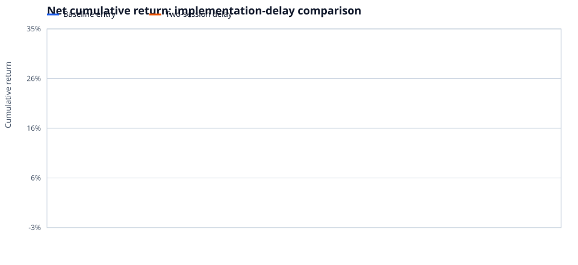
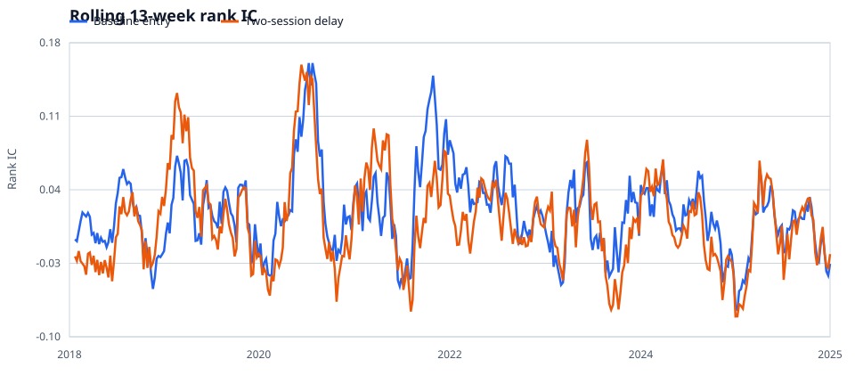
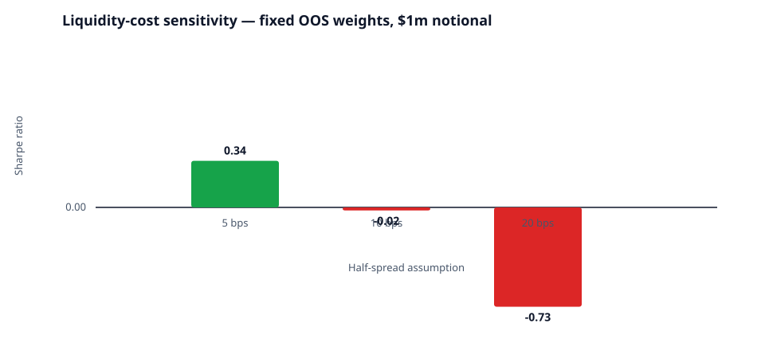

# Final research report

## Status

Completed baseline run on 19 September 2026. This is an educational, public-data benchmark—not investment advice or a production trading result.

### Reproduce

Run `python download_data.py --limit 300`, then invoke `run_research.py` with the generated equity panel and SPY benchmark. The committed README provides the full command. The documented baseline output directory is `data/processed/sp500_ridge_next_open_20260919` (excluded from Git because it contains generated data).

## Methodology

- Universe: liquid US equities screened using trailing median dollar volume and prior-day price.
- Target: five-trading-day residual return using trailing market beta.
- Validation: chronological walk-forward folds with a label-overlap embargo.
- Portfolio: weekly rebalancing with next-session-open entry and five-session-close marking; decile long/short selections with dollar, sector, and beta exposure controls.
- Costs: turnover-proportional transaction costs reported alongside gross performance.

## Required results

Report only out-of-sample metrics: Pearson/rank IC, IC IR, directional accuracy, annualized return/volatility, Sharpe, drawdown, turnover, gross/net returns, exposure diagnostics, yearly results, and market-regime splits.

## Baseline run: current S&P 500 public-data snapshot

| Item | Result |
| --- | ---: |
| Universe | 300 current S&P 500 constituents, liquidity/price screened |
| Raw observations | 641,074 daily equity-price rows |
| Model | Ridge regression on cross-sectional technical features |
| Validation | Expanding walk-forward; 504 training days, 5-day embargo, 252-day test blocks |
| OOS prediction observations | 101,267 |
| Mean Pearson IC / rank IC | 0.0129 / 0.0079 |
| Rank-IC information ratio | 0.0480 |
| Directional accuracy | 50.05% |
| Rebalance observations | 149 weekly portfolios, 28 Feb 2020–11 Sep 2026 |
| Gross annualized return / volatility / Sharpe | 3.43% / 7.56% / 0.45 |
| Net annualized return / volatility / Sharpe | -0.72% / 7.56% / -0.10 |
| Net maximum drawdown | -9.35% |
| Mean one-way weekly turnover | 78.84% |
| Assumed transaction cost | 10 bps per unit of turnover |
| Max absolute dollar / beta / sector exposure | < 2e-14 / < 4e-14 / < 9e-15 |

The net result is weak after costs. The correct conclusion is that this baseline does not establish a tradable alpha; future work should compare feature groups, tune only within walk-forward validation, and test sensitivity to costs and selection size.

## Limitations

The run uses a snapshot of **current** S&P 500 members and current sector classifications. It therefore has material survivorship bias and is not a point-in-time constituent backtest. Yahoo Finance is a convenient public adjusted-price source, not an institutional data feed. The project is educational research, not investment advice.

## Point-in-time membership proxy: completed run

This follow-up run uses the public `pitindex` S&P 500 membership reconstruction,
daily Yahoo prices, and the official Fama–French five-factor series. It is a
more demanding research control than the current-constituent benchmark, but it
is still a **public-data proxy**, not a CRSP-grade survivorship-free study:
Yahoo did not return price histories for 137 of 729 identified historical
members, and corporate actions/delisting returns remain source limitations.

| Item | Baseline execution | Two-session delayed execution |
| --- | ---: | ---: |
| Membership records / members with price history | 729 / 592 | 729 / 592 |
| Validation | Nested expanding walk-forward; 504 train days, 5-day embargo, 252-day outer blocks | Same |
| OOS prediction observations | 187,096 | 187,096 |
| Mean Pearson IC / rank IC | 0.0195 / 0.0184 | 0.0100 / 0.0111 |
| Net annualized return / volatility / Sharpe | 3.13% / 5.52% / 0.57 | 1.35% / 5.67% / 0.24 |
| Maximum drawdown | -7.02% | -8.93% |
| Weekly portfolios / mean turnover | 362 / 76.98% | 357 / 77.63% |

The delay result is materially weaker, indicating forecast/execution decay.
The liquidity sensitivity is also fragile: with fixed OOS weights and a $1m
notional, baseline Sharpe is 0.34 at a 5 bps half-spread assumption, -0.02 at
10 bps, and -0.73 at 20 bps. The delayed study is 0.02, -0.33, and -1.02 under
the same assumptions. These results **do not justify an alpha claim**. They
are evidence that the project measures implementation risk instead of selecting
the most flattering backtest.

Holding-period factor regressions are written with every run. Baseline factor
exposures are small but not zero (for example, market beta 0.025), so future
work should add factor constraints to the optimizer before treating any
residual return as pure alpha.

## Visual diagnostics

The interactive [research dashboard](dashboard.html) provides the same
completed-study evidence in a compact review surface.







### Reproduction

```bash
python download_pit_data.py --start 2016-01-01 --end 2025-12-31
python download_factors.py --output data/raw/fama_french_5_daily.parquet
python run_research.py \
  --panel data/raw/sp500_pit_prices.parquet \
  --benchmark data/raw/spy_benchmark.parquet \
  --universe-history data/raw/sp500_pit_universe.parquet \
  --factors data/raw/fama_french_5_daily.parquet \
  --output data/processed/sp500_pit_proxy \
  --model ridge --nested-validation --ridge-alphas 1,10,100 --test-days 252 \
  --cost-model liquidity --cost-sensitivity-bps 5,10,20 \
  --notional-sensitivity 1000000,5000000,10000000

python generate_report_assets.py
```
